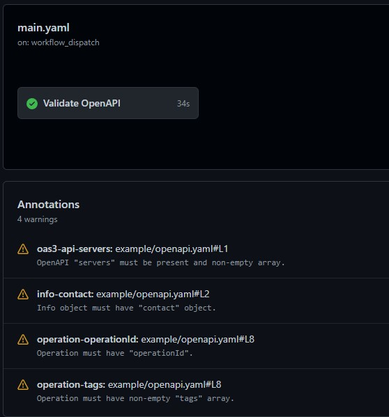

# Lint API Documentation

This is the GitHub action for validating OpenAPI and AsyncAPI docs using Spectral.

## Demo



## Example

```yaml
name: Validate API Workflow

jobs:
  lint-openapi:
    runs-on: ubuntu-latest
    name: Validate API
    steps:
      - uses: actions/checkout@v2
      - name: Check that the OpenAPI file is valid
        uses: morigs/lint-api-docs-action@v1
        with:
          files-glob: ./api/openapi.yaml
          ruleset-file: ./.spectral.yaml
          fail-severity: warn
```

## Inputs

There are no required inputs.

`files-glob` - glob specifying files to run linter on.. Default is `./**/*@(open|async)api.y?(a)ml`.
`ruleset-file` - path or URL to file containing Spectral ruleset. If not specified, then default ruleset will be used.
`fail-severity` - Results of this level or above will trigger a failure of the check. Available levels: error, warn, info, hint, off.

Default ruleset:

```yaml
extends: ['spectral:oas', 'spectral:asyncapi']
```
